# Algoritmo QNodes - Descripción Macroalgoritmica

En esta sección está la explicación generalizada o macroalgoritmo Q/QNodes. Así mismo en la implementación del código se cuenta una extensa documentación sobre su funcionamiento.

## Inicialización y Preparación

1. **Inicializar QNodes**: Se crea una instancia de la clase QNodes heredando de SIA (System Irreducibility Analysis).

2. **Aplicar Estrategia**: El punto de entrada del algoritmo recibe los parámetros:
   - `condicion`: Condiciones del sistema
   - `alcance`: Elementos del subsistema a analizar (purview)
   - `mecanismo`: Elementos del mecanismo en la red

3. **Preparar Subsistema**: Se configura el subsistema con los parámetros recibidos.

4. **Definir Conjuntos y Configurar Índices**:
   - Se crean conjuntos `futuro` (elementos en tiempo de efecto)
   - Se crean conjuntos `presente` (elementos en tiempo actual)
   - Se configuran índices y dimensiones para los nodos manejados en correlación a estos futuros y presentes respectivamente.

## Algoritmo Q Principal

5. **Llamada al Algoritmo Principal**: Se invoca `algorithm` con los vértices combinados *(en formato tupla, donde la primera posición intica el tiempo $0$ para $t_0$ o $1$ $t_1$ y en la segunda posición el índice o dimensión del subsistema)*.

6. **Inicialización de Conjuntos Base**:
   - `omegas_origen`: Contiene el primer elemento de los vértices
   - `deltas_origen`: Contiene todos los elementos restantes
   - `vertices_fase`: Inicializado con los vértices originales

   Como tal el uso de índices en las iteraciones no tiene uso dentro al algoritmo, no obstante permite entender las fases, ciclos e iteraciones.

7. **Bucle Principal de Fases (i)**:
   Para cada fase `i` en el rango `(len(vertices_fase) - 2)` *(básicamente iterar todos los elementos exeptuando el primero pues es el nodo ya tomado en omega al inicio y el final puesto ya se conocerá cuál será el peor elemento a tomar al momento que queden 2 y se seleccione el mejor)*:
   Es en esta fase donde podemos apreciar que en cada iteración el conjunto de particiones candidatas tiende a aumentar.

   1. **Inicialización de Ciclo**:
      - `omegas_ciclo`: Comienza con el primer elemento de `vertices_fase`
      - `deltas_ciclo`: Contiene todos los elementos restantes de `vertices_fase`
      - `emd_particion_candidata`: Inicializada como infinito positivo

   2. **Bucle de Ciclos (j)**:
      Para cada ciclo `j` en el rango `(len(deltas_ciclo) - 1)` se realiza lo que es la selección del mejor elemento (delta) para añadir a omega, de forma que se incrementa hasta la penúltima iteración, donde nuevamente ya conocemos cuál será el peor cuando queden dos elementos y se evalúen sus EMDs:

      1. **Bucle de Iteraciones (k)**:
          Para cada iteración `k` en el rango `len(deltas_ciclo)` es donde se calcula cada EMD sobre los deltas remanentes del ciclo:

          1. **Evaluación Submodular**:
              - Llamar a `funcion_submodular(deltas_ciclo[k], omegas_ciclo)`
              - Esta función calcula:
                * `emd_delta`: EMD de la bipartición del delta individual
                * `emd_union`: EMD de la combinación de biparticionar (delta ∪ omega)
                * `dist_marginal_delta`: Distribución marginal del delta
              - Calcular `emd_iteracion = emd_union - emd_delta`

          2. **Actualización del Mejor Delta**:
              Al terminar el cálculo de la subrutina, si `emd_iteracion < emd_local`:
              - Actualizar `emd_local = emd_iteracion`
              - Guardar `indice_mip = k`

      2. **Movimiento del Delta Óptimo**:
          - Añadir `deltas_ciclo[indice_mip]` a `omegas_ciclo`
          - Eliminar `deltas_ciclo[indice_mip]` de `deltas_ciclo`

   3. **Almacenar Partición Candidata**:
       - Guardar en `memoria_particiones` la EMD y distribución de la partición actual

   4. **Crear Nuevo Par Candidato**:
       - Agrupar último elemento de `omegas_ciclo` y último elemento de `deltas_ciclo` como una lista (formación del par candidato)
       - Actualizar `vertices_fase` con estos nuevos grupos, que es modificar el conjunto V inicial, de forma que ahora se tiene la agrupación del par/grupo candidato,

8. **Selección de Partición Óptima**:
   - Retornar la partición con la menor EMD de todas las almacenadas en `memoria_particiones`

## Función Submodular

La función submodular evalúa la combinación de conjuntos delta y omega:

1. **Evaluar Delta Individual**:
   - Preparar una copia temporal del subsistema
   - Activar los nodos delta en sus tiempos correspondientes
   - Bipartir el subsistema usando solo delta
   - Calcular EMD del delta individual
   
2. **Evaluar Combinación Delta ∪ Omega**:
   - Añadir nodos omega a la copia temporal
   - Bipartir el subsistema completo
   - Calcular EMD de la unión delta ∪ omega
   
3. **Retornar Resultados**:
   - Devolver `(emd_union, emd_delta, vector_delta_marginal)`

## Finalización

1. **Formatear Partición Óptima**: Prepara el resultado para devolver.
2. **Crear Objeto Solution**: Encapsula toda la información de la solución.
3. **Retornar Resultado**: Devuelve el objeto Solution con la partición óptima encontrada.

## Diagrama de Flujo

Para una mejor visualización, busca en *Extensiones* el complemento de *"Markdown Preview Mermaid Support"*, así mismo puedes dar click derecho en esta vista y pulsar "Open in browser" si quieres acercarte con mayor detalle

```mermaid
flowchart TD
    %% Elegant academic pastel palette
    classDef startStop  fill:#ffd6d6,stroke:#d9a0a0,stroke-width:2px,color:#6b0000,font-weight:bold
    classDef io         fill:#d9d9ff,stroke:#9f9fe6,stroke-width:2px,color:#00005c,font-weight:bold
    classDef process    fill:#ffeccb,stroke:#e6c89c,stroke-width:2px,color:#663f00
    classDef decision   fill:#d6ffd6,stroke:#9ee69e,stroke-width:2px,color:#004d00,font-weight:bold
    classDef submodular fill:#e6f3ff,stroke:#b3d9ff,stroke-width:2px,color:#003366
    classDef algorithm  fill:#fff0e6,stroke:#ffcc99,stroke-width:2px,color:#cc6600

    %% Main nodes
    A[Start]:::startStop
    B[/ Subsystem Preparation /]:::io
    C[Prepare subsystem and configure SIA]:::process
    D[/ Algorithm Call:<br/>Combined Vertices /]:::io

    %% Q Algorithm MAIN STEPS (compact)
    E[Initialize base sets & phase variables]:::algorithm
    F["Phase main loop:<br/>For each phase (i)<br/>  - Cycle init<br/>  - For each cycle (j) and iteration (k)<br/>    - Select optimal delta,<br/>    - Update sets,<br/>    - Store partition<br/>"]:::algorithm

    %% Decisions
    G{For each remaining delta?}:::decision
    H{More iterations in cycle?}:::decision
    I{More phases?}:::decision

    %% Submodular Function as one block
    J[Submodular Evaluation:<br/>- EMD for delta and union<br/>- Update best candidate]:::submodular

    %% Partition memory & selection
    K[Store partition candidates & group for next phase]:::algorithm
    L[Select partition with minimal EMD]:::algorithm

    %% Finalization
    M[Format optimal partition & create Solution object]:::process
    N[/ Output Solution /]:::io
    O[End]:::startStop

    %% Main flow
    A --> B --> C --> D --> E --> F --> G

    %% Submodular function loop
    G -- Yes --> J --> K --> H
    H -- Yes --> G
    H -- No  --> I
    I -- Yes --> F
    I -- No  --> L

    L --> M --> N --> O

    %% Negative ("No") path for first delta selection (shows skip -- if no candidates)
    G -- No --> I

    %% Style assignments
    A:::startStop
    B:::io
    C:::process
    D:::io
    E:::algorithm
    F:::algorithm
    G:::decision
    H:::decision
    I:::decision
    J:::submodular
    K:::algorithm
    L:::algorithm
    M:::process
    N:::io
    O:::startStop
```

